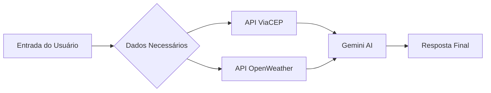

## O que foi feito
<!-- Descreva brevemente as mudanças deste PR -->

## Issue relacionada
<!-- Ex: Closes #12 -->

## Arquitetura do Projeto

## Como funciona

O Smart-Sleep recebe informações do usuário, consulta APIs externas e usa IA para gerar recomendações personalizadas de sono.
