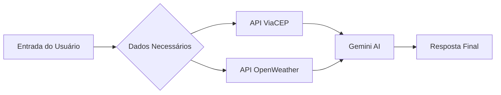

# Smart-Sleep
Sensor de temperatura + luz + Spotify → IA monta rotina de sono + playlist

## Integrantes:
| Nome | GitHub |
|------|--------|
| Olavo Belfante Dias | @OlavoBD |
| Lorenzo Dias Lanzoni | @LorenzoDL |
| Simão Kiaku Pedro Quanguluka | @Simao2026 |

## Arquitetura do Projeto

## Como funciona

O Smart-Sleep recebe informações fornecidas pelo usuário, como CEP/localização e dados relacionados ao sono ou rotina. Em seguida, o sistema consulta APIs externas para obter informações úteis, como clima e localização, e envia esses dados para o Gemini, que processa tudo de forma inteligente. Por fim, o usuário recebe uma resposta personalizada com dicas, análises e sugestões para melhorar a qualidade do sono.
