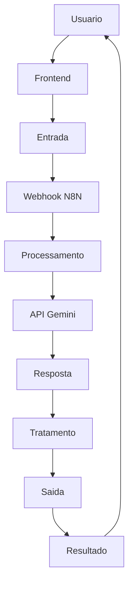

# Smart-Sleep
Sensor de temperatura + luz + Spotify → IA monta rotina de sono + playlist

## Integrantes:
| Nome | GitHub |
|------|--------|
| [Olavo Belfante Dias] | [@OlavoBD] |
| [Lorenzo Dias Lanzoni] | [@LorenzoDL] |
| [Simão Kiaku Pedro Quanguluka] | [@Simao2026] |

## Arquitetura

flowchart LR

A([👤 Entrada do Usuário]) --> B{🔎 Dados Necessários}

B --> C[📍 API ViaCEP  
Localização]
B --> D[🌤️ API OpenWeather  
Clima Atual]

C --> E[🤖 Gemini AI  
Processamento Inteligente]
D --> E

E --> F([💡 Resposta Final  
Dicas para Sono])

style A fill:#1f6feb,color:#fff,stroke:#0d419d,stroke-width:2px
style B fill:#8250df,color:#fff,stroke:#5a32a3,stroke-width:2px
style C fill:#238636,color:#fff,stroke:#196c2e,stroke-width:2px
style D fill:#d29922,color:#fff,stroke:#9a6b00,stroke-width:2px
style E fill:#cf222e,color:#fff,stroke:#8c151d,stroke-width:2px
style F fill:#0969da,color:#fff,stroke:#0550ae,stroke-width:2px

## Como funciona

O Smart-Sleep recebe informações fornecidas pelo usuário, como CEP/localização e dados relacionados ao sono ou rotina. Em seguida, o sistema consulta APIs externas para obter informações úteis, como clima e localização, e envia esses dados para o Gemini, que processa tudo de forma inteligente. Por fim, o usuário recebe uma resposta personalizada com dicas, análises e sugestões para melhorar a qualidade do sono.
