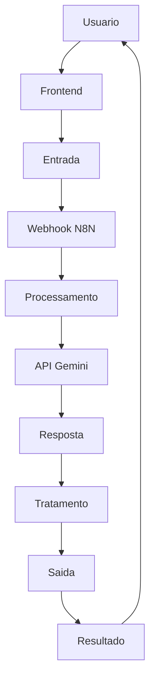

# Smart-Sleep
Sensor de temperatura + luz + Spotify → IA monta rotina de sono + playlist

## Integrantes:
| Nome | GitHub |
|------|--------|
| [Olavo Belfante Dias] | [@OlavoBD] |
| [Lorenzo Dias Lanzoni] | [@LorenzoDL] |
| [Simão Kiaku Pedro Quanguluka] | [@Simao2026] |

## Arquitetura

